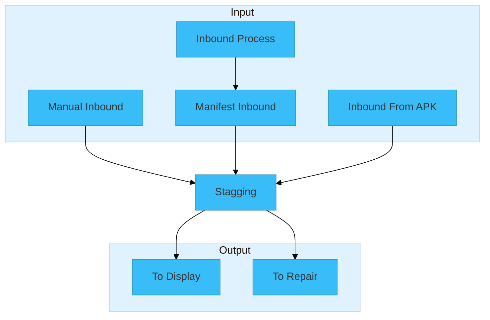

## Flow

Terdapat beberapa jalur untuk inbound, yaitu: 

1. [Manifest Inbound](/front-end/inbound/manifest-inbound)
2. [Manual Inbound](/front-end/inbound/manual-inbound)
3. [Bulking Inbound](/front-end/inbound/bulking-inbound)
4. [Inbound Form Apk](/front-end/inbound/inbound-form-apk)

Setelah proses tersebut selesai maka barang akan masuk beberapa alur **Stagging** berikut:

<Cards>
    <Card
    href="/front-end/inbound/stagging/to-display"
    title="Stagging to Display"
    >
        Pindah barang Stagging ke Display
    </Card>
    <Card
    href="/front-end/inbound/stagging/to-repair"
    title="Stagging to Repair"
    >
        Pindah barang Stagging ke Repair
    </Card>
</Cards>

## Analogi

