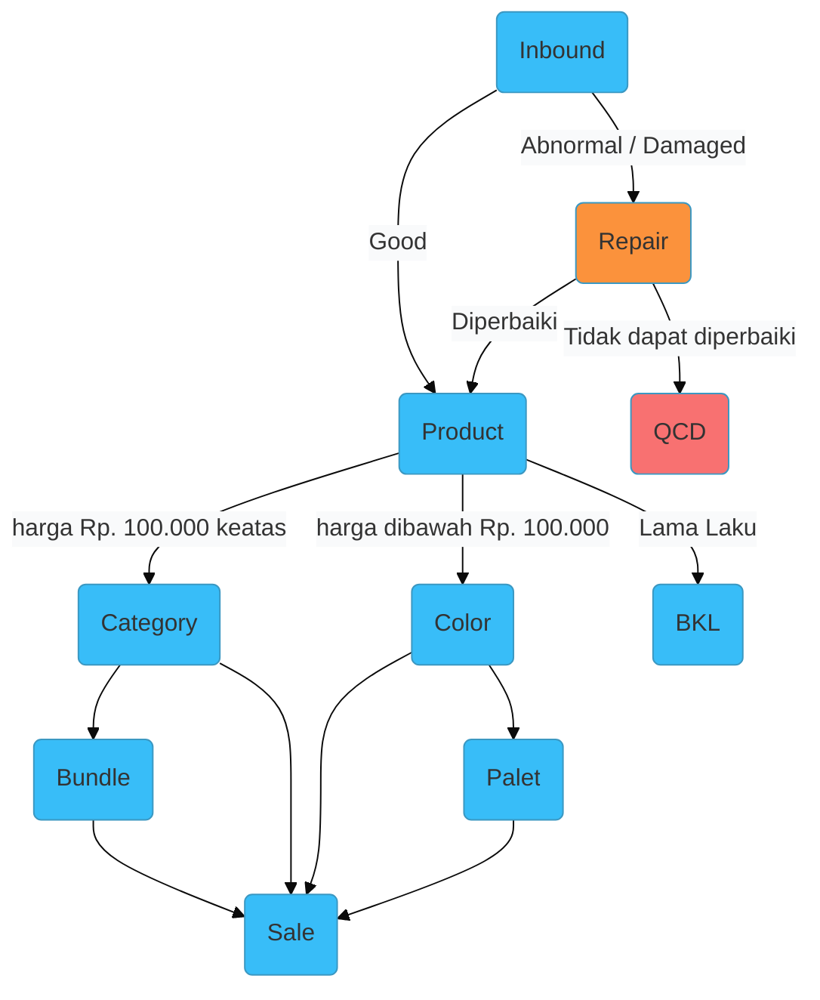

## Fitur

Berikut fitur modul storage:

1. **Product**, dibagi menurut harga sebagai berikut:
  <Cards>
    <Card title="Category">
      Product yang memiliki harga `Rp. 100.000 keatas`
    </Card>
    <Card title="Color">
      Product yang memiliki harga `dibawah Rp. 100.000`
    </Card>
  </Cards>
2. Bundle
3. Palet
4. BKL
5. Repair
6. QCD

## Analogi

Berikut Analogi modul storage:

